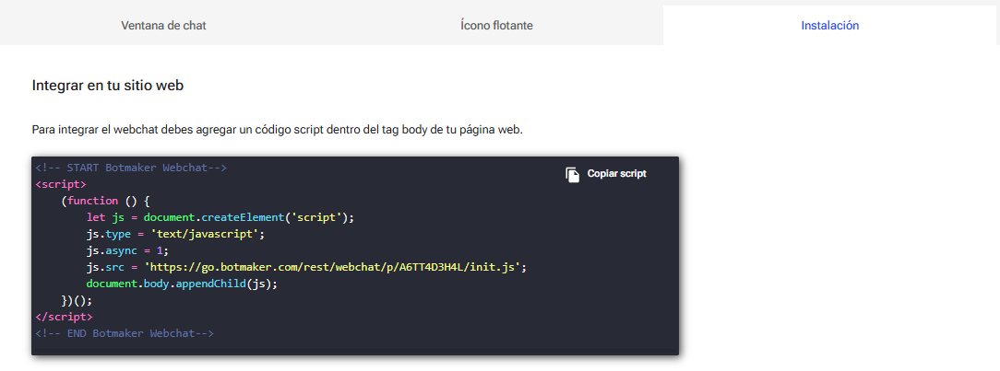

# botmaker_webchat_flutter

Ejemplo Webchat con Flutter.

- Podés probar usando el script de tu bot

- El script de integración se consigue en:
  **go.botmaker.com/#/integrations/channels → Webchat -> "Probar Webchat" o "Instalación"**.

El WebchatID configurable se saca de js.src:

`js.src = 'https://go.botmaker.com/rest/webchat/p/A6TT4D3H4L/init.js'` --> A6TT4D3H4L

**Para ejecutar**
- Se puede conectar un dispositivo Android mediante USB (validar en opciones de desarrollador que 'Depuración por USB' esté activado)
- Correr: `flutter pub get`, `flutter devices` para validar que el dispositivo es reconocido. Si aparece, ejecutar: `flutter run -d <device_id>`. 
- Otra opción: Usar emuladores de Android. 
